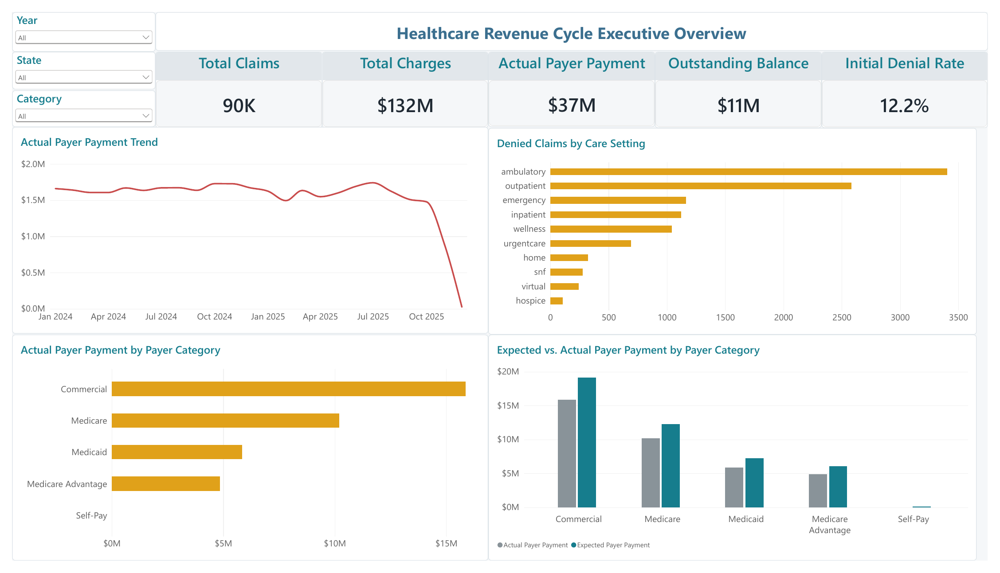
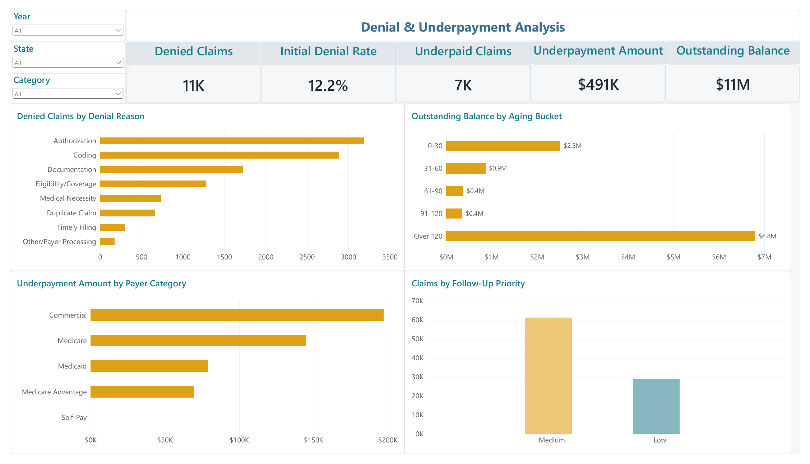
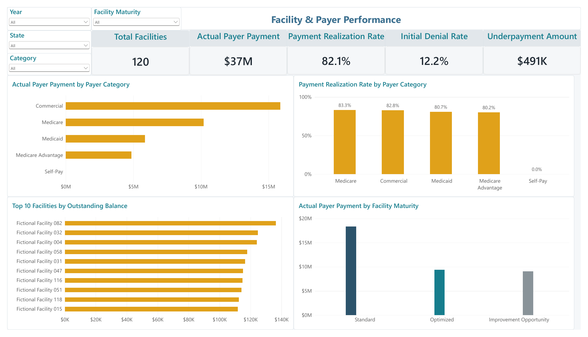

# Healthcare Revenue Cycle Analytics

A portfolio project analyzing healthcare claims, payer performance, denials, underpayments, aging, and facility-level revenue-cycle results across a multi-state dataset.

Built with **Power BI, Power Query, DAX, Python, and SQL** to demonstrate an end-to-end analytics workflow—from data preparation and modeling through executive reporting and operational insight.

> **Portfolio disclaimer:** This project uses synthetic data and fictional facility names. It was created independently for educational and portfolio purposes and does not represent any healthcare organization or contain protected health information.

## Project Overview

Revenue-cycle teams need a clear view of where reimbursement is being delayed, denied, or underpaid. This project brings claims, payer, facility, and follow-up information into a unified analytical model that supports both executive monitoring and operational investigation.

The completed dataset contains:

- **90,000 claims**
- **120 fictional healthcare facilities**
- **10 states**
- **2024–2025 service and payment activity**
- Commercial, Medicare, Medicaid, Medicare Advantage, and self-pay categories
- Inpatient, outpatient, emergency, ambulatory, urgent care, home, skilled nursing, virtual, hospice, and wellness settings

## Dashboard Preview

### 1. Executive Overview

Provides a high-level view of claim volume, charges, payer payments, outstanding balances, denial activity, payment trends, and payer-category performance.

### 2. Denial & Underpayment Analysis

Identifies the principal sources of revenue leakage through denial reasons, aging buckets, payer underpayments, and follow-up prioritization.

### 3. Facility & Payer Performance

Compares payment realization, denial rates, payer performance, facility maturity, and the facilities carrying the largest outstanding balances.

## Key Performance Indicators

| KPI | Portfolio Result |
|---|---:|
| Total claims | 90,000 |
| Total charges | $132M |
| Actual payer payments | $37M |
| Outstanding balance | $11M |
| Initial denial rate | 12.2% |
| Denied claims | 11K |
| Underpaid claims | 7K |
| Underpayment amount | $491K |
| Payment realization rate | 82.1% |
| Facilities analyzed | 120 |

## Key Findings

- More than **$6.8M of the $11M outstanding balance** sits in the **over-120-day** aging bucket, making aged receivables the most significant collection risk.
- **Authorization** is the leading initial denial reason, followed by coding and documentation issues.
- Commercial claims produce the highest total payer payments but also the largest underpayment exposure.
- Medicare has the strongest payment realization rate at **83.3%**, followed closely by commercial payers at **82.8%**.
- Facility-level results reveal meaningful variation in outstanding balances and payment performance, supporting targeted follow-up rather than a single system-wide response.
- A large share of claims remains in the medium-priority follow-up category, creating an opportunity to refine work queues using balance, age, denial, and underpayment indicators.

## Business Questions Addressed

1. How much billed revenue has converted into actual payer payment?
2. Which payer categories contribute the most revenue and underpayment exposure?
3. What denial reasons create the greatest operational burden?
4. How much outstanding balance is aging beyond 120 days?
5. Which facilities require focused collection or process-improvement support?
6. How does payment realization vary by payer category and facility maturity?
7. Which claims should be prioritized for follow-up?

## Analytical Workflow

1. Generated a realistic synthetic claims dataset spanning multiple states, facilities, payer types, care settings, and service dates.
2. Cleaned and standardized source files using Python and Power Query.
3. Built a relational data model connecting claims with facility, payer, denial, and operational attributes.
4. Created DAX measures for financial, utilization, denial, underpayment, aging, and realization metrics.
5. Designed three interactive Power BI pages for executive, operational, facility, and payer analysis.
6. Validated dashboard totals, filter behavior, chart logic, and category definitions.
7. Exported the final report for portable review and portfolio presentation.

## Dashboard Features

- Year, state, claim category, and facility-maturity slicers
- Executive KPI cards
- Monthly payment trend analysis
- Expected-versus-actual payment comparison
- Denial-reason analysis
- Accounts-receivable aging segmentation
- Underpayment analysis by payer category
- Follow-up priority distribution
- Top-10 facility ranking by outstanding balance
- Payment realization comparisons
- Facility maturity segmentation

## Tools and Skills Demonstrated

- **Power BI:** Data modeling, report design, interactions, slicers, and dashboard development
- **Power Query:** Data shaping, standardization, validation, and transformation
- **DAX:** KPI measures, financial calculations, denial rates, aging, and payment-realization logic
- **Python:** Synthetic data generation, data preparation, quality checks, and analytical modeling
- **SQL:** Database creation, structured querying, and validation
- **Healthcare analytics:** Claims, reimbursement, denials, underpayments, payer performance, aging, and revenue-cycle operations
- **Data storytelling:** Translating detailed claims data into executive and operational insights

## Repository Files

| File | Description |
|---|---|
| [Healthcare Revenue Cycle Project.pbix](power-bi/Healthcare%20Revenue%20Cycle%20Project.pbix) | Interactive Power BI report |
| [Healthcare Revenue Cycle Project.pdf](power-bi/Healthcare%20Revenue%20Cycle%20Project.pdf) | Three-page exported dashboard |
| [assets/](assets/) | Dashboard preview images used in this README |

## How to View the Project

- Open the **PDF** for a quick, three-page review of the completed report.
- Download the **PBIX** file and open it in Microsoft Power BI Desktop for interactive filtering and exploration.
- Use the preview images above for a fast overview directly within GitHub.

## Author

**Lisa A. Phillips, MBA**  
Healthcare Analytics | Business Intelligence | Medicare Operations

[LinkedIn](https://www.linkedin.com/in/lisaphillips106) · [GitHub](https://github.com/beachblondie106-coder)
